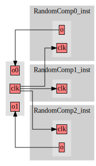

#  Cerata
Cerata is a Hardware Construction Library written in C++17. It allows you to describe hardware structures using C++.
The hardware structures are basically graphs (components and instance graphs) with nodes (signals, ports, parameters, 
literals).

Rather than suffering from the verbosity of languages such as VHDL and Verilog, a developer can use Cerata to 
programmatically construct potentially complex and nested types, and "drag" them around the design with a few lines of 
code. The hassle of turning the graph representation into something synthesizable for various output targets 
(especially FPGA) is left to Cerata's back-ends.

Furthermore, it allows you to programmatically inspect and modify constructed graphs. This allows other code to 
reflect on designs that were generated, for whatever purpose. Examples include: adding profilers to streams or creating
optimized bus infrastructures based on bus interfaces exposed by some components way down in your hierarchy.

Cerata currently only focuses on structure, not on behavior. Although it might look somewhat similar at a 
first glance, it is not an Embedded Hardware Construction Language like Chisel, where you can also describe 
combinatorial and sequential transformations on your signals and ports. That project is much more advanced, and you 
should check it out, if like Scala and having a relatively large and complicated dependency. Cerata is just a bit 
lighter-weight but less feature-rich for now.

Currently, there is no front-end language for Cerata, or a storage format for the graphs. We developed Cerata mainly as
a companion library of Fletcher, but it does not include anything specific to Fletcher in its codebase.

## Example:

This simple example generates a component with a bunch of instantiations of two other components.
If you care or think it's relevant, this would be about 150 lines of VHDL.

```C++
// A parameter node.
auto x_width = parameter("width", 32);
// A type using the parameter node as generic.
auto rec = record({field("foo", bit()),
                 field("bar", vector(x_width)),
                 field("parent", stream("child", stream("data", vector(32))))});
// A size parameter for the port array.
auto size = parameter("array_size", 0);
// A component declaration using all of the above.
auto x = component("x", {x_width,
                       size,
                       port_array("a", rec, size, Port::IN)});
// Another parameter for the next component.
auto y_width = parameter("width", 32);
// Another component. The record type is rebound to use the new parameter as generic.
auto y = component("y", {y_width,
                       port("b", (*rec)({y_width}), Port::OUT)});
// The top-level component.
auto top = component("top");
// Instantiate one X component.
auto xi = top->Instantiate(x);
// Instantiate three Y components.
for (int i = 0; i < 3; i++) {
auto yi = top->Instantiate(y);
// Append the port array "a" on X, and source it with port "b" of the new Y instance.
xi->prt_arr("a")->Append() <<= yi->prt("b");
}
```

This example would be easy to write in VHDL too, using the "for ... generate" statement.
However, we can also programmatically inspect the components that we generated in Cerata.

In the following example, we'll generate a few bottom-level components that could or could
not have some output bit. We can just inspect the generated component before we instance it
and connect that bit at the top-level.

```C++
  // Generate a bunch of components randomly containing some output.
  std::vector<std::shared_ptr<Component>> random_components;
  for (int i = 0; i < 3; i++) {
    // Another parameter for the next component.
    auto comp = component("RandomComp" + std::to_string(i), {port("clk", bit(), Port::IN)});
    if (std::rand() % 2 == 1) {
      comp->Add(port("o", bit(), Port::OUT));
    }
    random_components.push_back(comp);
  }

  // Instantiate the top level.
  auto top = component("top", {port("clk", bit(), Port::IN)});
  int j = 0;
  for (int i = 0; i < 3; i++) {
    // Instantiate every random component.
    auto inst = top->Instantiate(random_components[i]);
    Connect(inst->prt("clk"), top->prt("clk"));
    // Check if it has a port we'd also want to expose at the top-level.
    if (inst->Has("o")) {
      auto top_port = port("o" + std::to_string(j), bit(), Port::OUT);
      top_port <<= inst->Get<Port>("o");
      top->Add(top_port);
      j++;
    }
  }
```

This results in the following design:



For more elaborate examples, check out the tests or check out Fletchgen.
If there is interest for more elaborate documentation, please open an issue.
